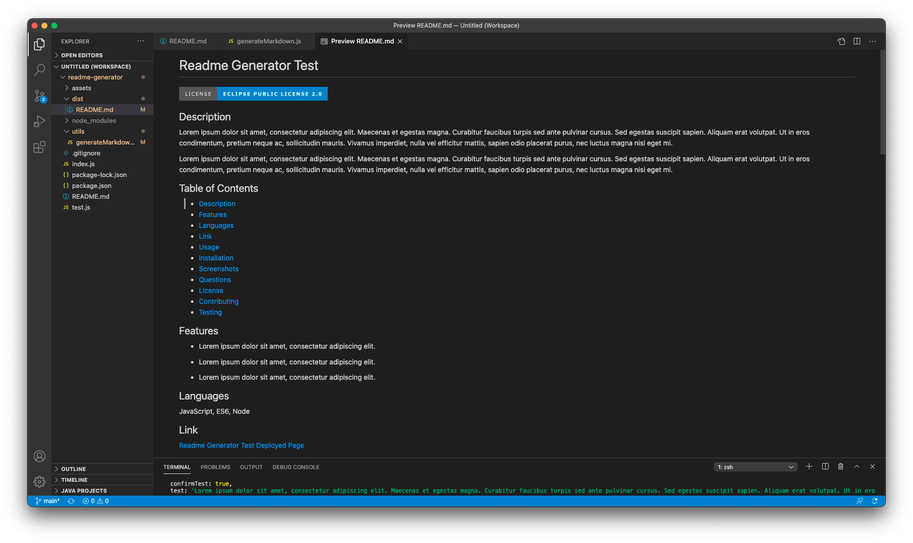

# README GENERATOR

## Description 

This is a back-end projected developed with node.js to create a professional readme file for professional webdevelopers. This application uses the command line in the user's Terminal to create a readme file by asking a variety of questions. These questions are prompted using [node.js](https://nodejs.org/en/) and created with [Inquirer Package](https://www.npmjs.com/package/inquirer). The user is able to put in as much information as they would like, per prompted question, and then the application writes a README.md file and organizes the questions based off of the user's input.

This project was created with the goal of making the creation of a professional README.md file as easy as possible. The user already has a lot of work on their plate when it comes to creating a fully functioning application. This app takes the design and guessing out of the user's hands and creates a fully functioning, professional readme with just a few answers from the user. 

## Table of Contents

* [Languages](#languages)
* [Installation](#installation)
* [Usage](#usage)
* [Credits](#credits)
* [License](#license)

## Languages and Features

JavaScript, ES6, Node.js, npm Inquirer Package

## Links

[README.md Generator GitHub](https://github.com/ericasiegel/readme-generator.git)

[Generated Readme Example]()

[Readme Generator Video Walkthrough](https://github.com/ericasiegel/readme-generator.git)

## Installation

- Clone the Readme Generator from [ericasiegel/readme-generator.git](https://github.com/ericasiegel/readme-generator.git) into a directory file of your choice using the Terminal on your computer.

## Usage 

- Navigate to the readme-generator folder in your Termal.
- In the command line of your Terminal type in "node index" to begin the program.
- Follow the prompted questions and answer them with as much detail as possible.
- Once the questions have all been filled out, the program will end and 'README created! Go to the "dist" folder to see it!' will show up in the console indicating the README.md file has been created. 
- Navigate to the "dist" folder and you will see a new README.md file.
- Copy and paste that README.md into your app's drectory.

### Command Line Prompt in Terminal

### Prompted Questions in Terminal

### Required Question Error

### Successfuly Answered Questions

### Generated Readme Markdown

### Generated Readme

## Credits

- [node.js](https://nodejs.org/en/)
- [Inquirer Package](https://www.npmjs.com/package/inquirer)

